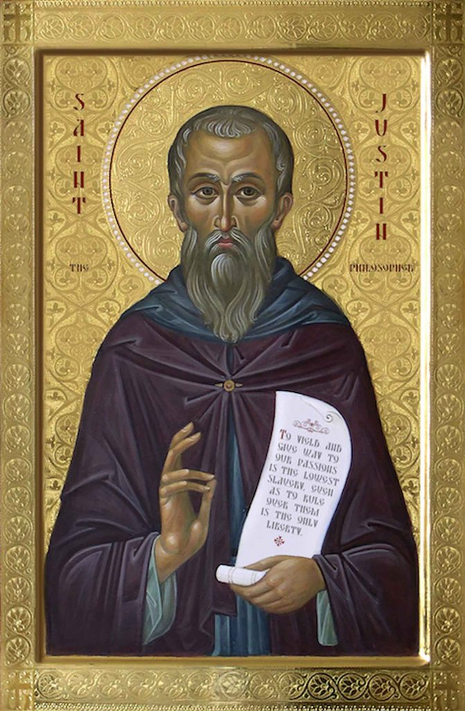
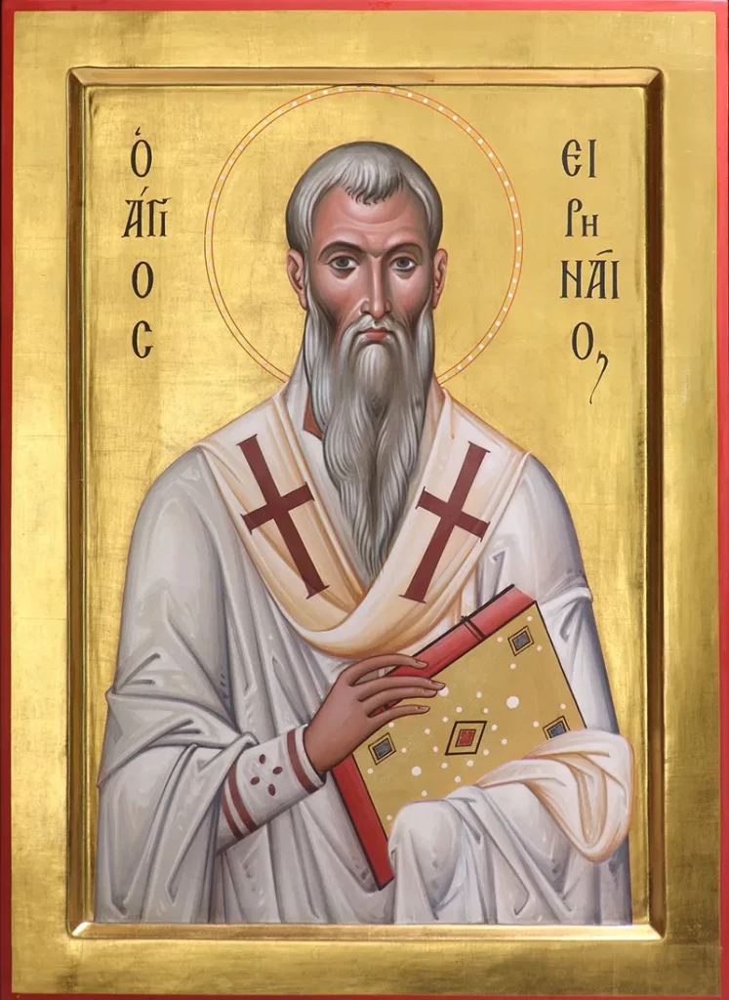
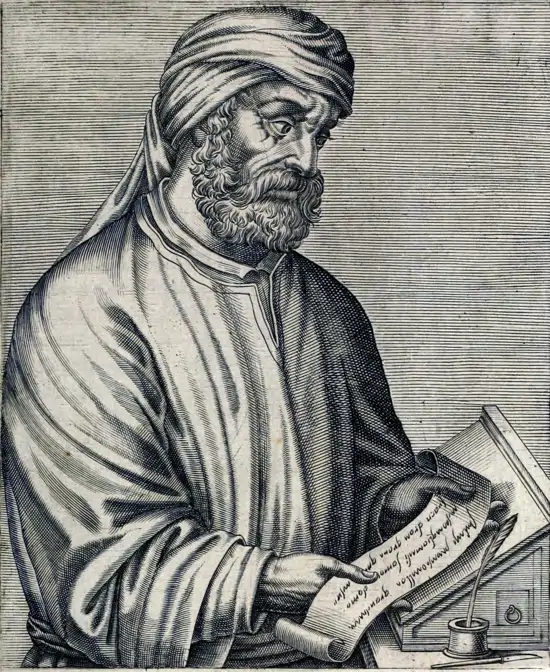
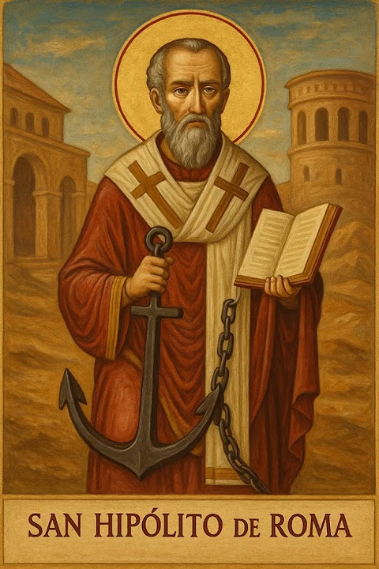
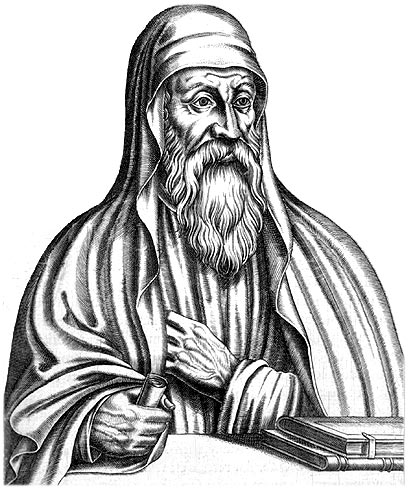
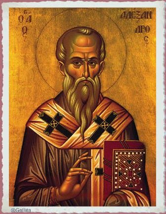
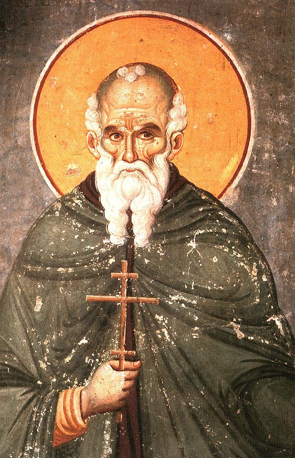

# 3. Anclaje patrístico de Nicea

> *Es Dios verdadero, siendo consustancial al verdadero Padre.*
>
> *Theos estin alēthinos, homoousios hyparchōn tō alēthinō Patri.*
>
> Atanasio, *Contra Arianos* I.9

---

Justino Mártir

c. 100 - 165

Ireneo de Lyon

c. 130 - 202

Tertuliano de Cartago

c. 155 - 220

Hipólito de Roma

c. 170 - 235

Orígenes de Alejandría

c. 185 - 254

Alejandro de Alejandría

m. 328

Atanasio de Alejandría

c. 296 - 373

## 3.1 Por qué importa este anclaje

La página 1 expuso el texto del credo de Nicea (325) y mostró que identifica gramaticalmente al único Dios con la persona del Padre como fuente. La página 2 examinó el anclaje bíblico de esa gramática: cómo el patrón paulino y joánico articula al Padre como fuente y al Hijo como aquel que recibe del Padre y media la actividad divina hacia el mundo. La pregunta que esta página aborda es complementaria: ¿qué hicieron los teólogos cristianos entre el cierre del Nuevo Testamento (final del siglo I) y el Concilio de Nicea (325) con ese patrón fontal?

La pregunta tiene importancia específica. Si el patrón fontal estuviera atestiguado solo en el Nuevo Testamento y solo en el símbolo conciliar, separados por más de tres siglos sin testimonio intermedio, podría sostenerse que la gramática nicena es invención conciliar sin continuidad histórica real con el lenguaje neotestamentario. Si en cambio se documenta que los teólogos cristianos de los siglos II, III y IV articulan continuamente el mismo patrón fontal, con vocabulario distinto pero estructura común, entonces el símbolo conciliar se entiende como codificación de una tradición continua, no como innovación tardía.

Esta página examina varios autores que articulan ese consenso patrístico previo a la consolidación capadocia: Justino Mártir e Ireneo de Lyon en el siglo II, Tertuliano de Cartago e Hipólito de Roma a caballo entre los siglos II y III, Orígenes de Alejandría en el siglo III, y Alejandro y Atanasio de Alejandría en el siglo IV. Cada uno opera en contexto polémico distinto, con vocabulario distinto, y sin embargo articula el mismo patrón estructural: el Padre como fuente única, el Hijo como Dios recibido del Padre. La pretensión de esta página no es presentar a estos autores como teólogos sin defectos ni como nicenos avant la lettre en cada detalle de su pensamiento; varios articulan elementos que la doctrina posterior no asumirá o matizará. Lo que se pretende mostrar es algo más modesto y más sólido: que la gramática fontal que Nicea codifica tiene anclaje real, continuo y verificable en la tradición patrística previa, aunque la formulación conciliar la depure y la articule con vocabulario más preciso.

---

## 3.2 Justino Mártir: la *taxis* trinitaria del siglo II

Justino Mártir (c. 100-165), filósofo cristiano de origen palestinense, escribió sus apologías en Roma hacia el año 155, apenas unas décadas después de los últimos escritos del Nuevo Testamento. Su *Primera Apología*, dirigida al emperador Antonino Pío para explicar y defender la práctica cristiana ante el poder político, articula la estructura trinitaria con orden (*taxis* (τάξις)) explícito:

> *Habiendo aprendido que él es el Hijo del Dios verdadero, y teniéndolo en el segundo lugar, y al Espíritu profético en el tercer rango.*
>
> *Huion autou tou ontōs Theou mathontes kai en deutera chōra echontes, pneuma te prophētikon en tritē taxei.*
>
> Justino Mártir, *Primera Apología* 13

La articulación es reveladora. El Padre es el Dios en sentido absoluto (*ho ontōs Theos* (ὁ ὄντως Θεός)). El Hijo ocupa el segundo lugar (*deutera chōra* (δευτέρα χώρα)). El Espíritu profético se sitúa en el tercer rango (*en tritē taxei* (ἐν τρίτῃ τάξει)). Hay un orden asimétrico real: el Padre es el referente primario de "Dios", el Hijo y el Espíritu ocupan posiciones cualificadas en relación con esa fuente.

Justino no usa vocabulario técnico posterior. No tiene *homoousios* (ὁμοούσιος), no tiene *hypostasis* (ὑπόστασις) en sentido estabilizado, no tiene la distinción entre cualidad esencial compartida y unicidad personal-fontal. Su lenguaje es pre-técnico. Pero la gramática estructural es la misma que el símbolo conciliar codificará dos siglos después: el "un Dios" es el Padre; el Hijo es "Hijo del Dios verdaderamente existente" (*Huion tou ontōs Theou* (Υἱὸν τοῦ ὄντως Θεοῦ)), recibiendo su posición de la fuente paterna; el Espíritu completa la articulación en posición tercera.

En su *Diálogo con Trifón*, Justino es más explícito. En el capítulo 61, formula la generación del Logos con una imagen que anticipa la que Tertuliano y Nicea usarán después:

> *Dios engendró antes de todas las criaturas un Principio, que era cierta potencia racional procedente de él mismo. [...] Como vemos que sucede en el caso de un fuego, que no disminuye cuando enciende otro, sino que permanece el mismo; y aquel que ha sido encendido por él igualmente existe por sí mismo, sin disminuir a aquel del que fue encendido.*
>
> Justino, *Diálogo con Trifón* 61

Y en el capítulo 128, Justino precisa que esta potencia "fue engendrada del Padre, por su poder y voluntad, pero no por escisión, como si la esencia del Padre se dividiera" (*Diálogo con Trifón* 128). El término es técnicamente importante: "escisión" (*apotomē* (ἀποτομή)) designa el corte o división de una sustancia en partes. Lo que Justino niega es que la generación del Hijo funcione como un corte que fragmenta la sustancia divina. La analogía del fuego lo ilustra: el fuego que enciende otro fuego no pierde nada; lo comunica todo sin dividirse. Alejandro de Alejandría (sección 3.7) usará exactamente la misma negación un siglo y medio después: el Hijo es engendrado "no por escisión o división". La estructura es fontal: el Logos no es autónomo respecto del Padre, sino que procede de él como el fuego encendido procede del fuego que lo enciende, sin disminuirlo, sin separarse de su naturaleza, pero siendo realmente distinto de él.

La analogía tiene límites que conviene reconocer. Un fuego encendido por otro, una vez encendido, arde por sí mismo sin que su existencia siga dependiendo del fuego originante. Justino mismo es consciente de la insuficiencia: por eso añade en *Diálogo* 128 la precisión de que la generación del Hijo no es por escisión, y por eso en otros pasajes recurre a otras imágenes (la palabra que el hombre profiere sin perder nada de sí mismo, *Diálogo* 61). La analogía ilustra la comunicación sin disminución; no agota la relación fontal eterna que la teología posterior articulará con vocabulario más preciso. La teoría justiniana del Logos no es asumida tal cual por Nicea; lo que la página retiene de Justino es la *estructura* fontal y ordinal del lenguaje sobre el Padre, el Hijo y el Espíritu, no cada elemento especulativo de su filosofía del Logos.

---

## 3.3 Ireneo de Lyon: la regla de fe apostólica

Ireneo (c. 130-202), obispo de Lyon, escribió su obra principal *Adversus Haereses* (Contra las herejías) hacia el año 180. Es el testimonio más extenso de la teología cristiana del siglo II y el primero en articular explícitamente una "regla de fe" (*kanōn tēs pisteōs*) recibida de los apóstoles. La comparación de esta regla con el símbolo niceno posterior es extraordinariamente instructiva.

La regla de fe, tal como Ireneo la formula:

> *La Iglesia, extendida por el orbe del universo hasta los confines de la tierra, recibió de los Apóstoles y de sus discípulos la fe en un solo Dios Padre Soberano universal, que hizo los cielos y la tierra y el mar y todo cuanto hay en ellos, y en un solo Jesucristo Hijo de Dios, encarnado por nuestra salvación, y en el Espíritu Santo.*
>
> Ireneo, *Adversus Haereses* I.10.1

La estructura es prácticamente idéntica al símbolo niceno: "un solo Dios Padre" / "un solo Jesucristo Hijo de Dios" / "el Espíritu Santo". La diferencia cronológica es de casi 150 años: Ireneo escribe hacia 180, Nicea se reúne en 325, Constantinopla en 381. El símbolo conciliar no inventa la gramática; la recibe de una tradición que ya operaba con ella en el siglo II y que Ireneo testimonia como apostólica.

Pero Ireneo no se limita a formular la regla. Explicita su gramática con precisión que merece documentación. Tres pasajes son especialmente directos.

**Primero**, Ireneo lee la fórmula paulina de 1 Corintios 8:4-6 como identificación explícita del "un Dios" con el Padre:

> *Sabemos que un ídolo es nada, y que ninguno es Dios sino uno solo. Luego, aunque haya algunos a los que se les denomina dioses o en el cielo o en la tierra, para nosotros el único Dios es el Padre, del que vienen todas las cosas y en el cual vivimos, y un solo Señor Jesucristo, por el cual existe todo, y nosotros por él (1 Corintios 8:4-6). Separa y distingue claramente a aquellos a los que se les llama, los cuales no son dioses, del único Dios Padre, del que todo viene, y confiesa con sus propias palabras al único Señor nuestro Jesucristo.*
>
> Ireneo, *Adversus Haereses* III.6.5

Ireneo lee 1 Corintios 8:6 como articulación de la identificación "el único Dios = el Padre" (*heis Theos ho Patēr*). Esta es la lectura que la página 2 documentó como gramática paulina y que el símbolo niceno reproduce.

**Segundo**, Ireneo formula una observación explícita sobre quién recibe el título "Dios" en el Nuevo Testamento:

> *Hemos expuesto enteramente, y aún lo probaremos con mayor amplitud, que ni los profetas ni los Apóstoles ni el Señor Jesucristo han confesado con sus propias palabras "Dios" o "Señor" a ningún otro sino a aquel que es el único Dios y Señor. Pues los profetas y Apóstoles confesaron al Padre y al Hijo, y a ningún otro llamaron "Dios" ni confesaron "Señor". También el Señor mismo solo llamó Padre, Señor y Dios suyo al único a quien él mismo enseñó a sus discípulos como el único Dios y Señor de todas las cosas.*
>
> Ireneo, *Adversus Haereses* III.9.1

La afirmación requiere lectura cuidadosa. Ireneo *no* está diciendo que el Hijo no sea divino. De hecho, en el mismo libro III Ireneo aplica el título "Dios" al Hijo de manera directa: lo llama "verdaderamente Dios y verdaderamente hombre" (*vere Deus et vere homo*, *AH* III.19.1-2) y afirma que el Padre es Señor y el Hijo Señor (*AH* III.6.2). Lo que está diciendo en III.9.1 es algo preciso sobre la distribución de los títulos en la Escritura: cuando profetas, apóstoles y el mismo Jesús usan el título "Dios" (*Theos* (Θεός)) de modo absoluto y referencial (sin calificación adicional) apuntan al Padre. La frase clave es "han confesado con sus propias palabras": Ireneo está leyendo el uso lingüístico escriturístico, no negando la divinidad del Hijo. El Hijo es "Hijo *de* Dios", "Señor" (*Kyrios* (Κύριος)), y también es Dios en sentido predicativo, pero el título "Dios" usado de modo absoluto apunta al Padre como referente. Esta es la distribución paulina de 1 Corintios 8:6, con "un Dios" (*heis Theos* (εἷς Θεός)) el Padre y "un Señor" (*heis Kyrios* (εἷς Κύριος)) Jesucristo, que Ireneo lee no como peculiaridad de Pablo sino como consenso de toda la Escritura tal como los apóstoles lo transmitieron. La gramática fontal nicena retiene exactamente esa misma distribución: el credo aplica "Dios" al Hijo, pero lo hace en forma cualificada (como "Dios de Dios, Luz de Luz, Dios verdadero de Dios verdadero"), donde la preposición "de" reproduce la asimetría fontal que Ireneo observa.

Conviene también situar el pasaje en su contexto polémico. El libro III de *Adversus Haereses* combate la tesis gnóstica de que existe un Dios superior desconocido distinto del Creador del Antiguo Testamento. La preocupación inmediata de Ireneo en III.9.1 es mostrar que la Escritura no conoce *otro Dios* además del Padre Creador que profetas, apóstoles y Jesús confesaron. La distribución de títulos que observa es real y articula la gramática fontal, pero el motor polémico inmediato es anti-gnóstico, no anti-trinitario: Ireneo no está separando al Hijo del Padre, sino al Creador-Padre del pretendido Dios oculto de los valentinianos. Reconocer este contexto no debilita la lectura fontal del pasaje; la sitúa con precisión.

La misma identificación aparece de forma reiterada a lo largo de la obra de Ireneo, lo cual indica que no es una observación aislada sino el eje articulador de su teología:

> *Ha sido declarado con toda evidencia que los predicadores de la verdad y Apóstoles de la libertad, a ningún otro llamaron Dios o Señor, sino al único Dios verdadero, el Padre, y a su Verbo que tiene la soberanía sobre todas las cosas.*
>
> Ireneo, *Adversus Haereses* III.15.3

> *Y que este mismo Dios es el Padre de nuestro Señor Jesucristo, lo dijo el Apóstol Pablo: "Uno solo es Dios Padre, que está sobre todos, por todos y en todos nosotros" (Efesios 4:6).*
>
> Ireneo, *Adversus Haereses* III.6.2

> *Probaremos que nada hay por encima de él ni fuera de él, sino que él hizo todas las cosas según su proyecto y libre voluntad, pues es el único Dios, el único Señor, el único Creador, el único Padre y el único que contiene en sí todas las cosas y da la existencia a todas ellas.*
>
> Ireneo, *Adversus Haereses* II.1.1

> *Y todos ellos nos han transmitido a un solo Dios Creador del cielo y de la tierra anunciado por la Ley y los profetas, y a un solo Cristo Hijo de Dios.*
>
> Ireneo, *Adversus Haereses* III.1.2

La acumulación de estos textos es significativa. Ireneo no formula "un solo Dios: Padre, Hijo y Espíritu Santo". Formula "un solo Dios, el Padre" y "un solo Cristo, Hijo de Dios". La distribución es siempre la misma: "Dios" en aposición con el Padre; el Hijo como "Hijo *de* Dios", "Cristo *de* Dios", "Verbo *del* Padre".

**Tercero**, la oración de Ireneo en el mismo libro revela la gramática devocional operante en el cristianismo del siglo II:

> *Yo también te invoco, Señor Dios de Abraham, Dios de Isaac y Dios de Jacob y de Israel, que eres el Padre de nuestro Señor Jesucristo, Dios que por la multitud de tu misericordia te has complacido en nosotros para que te conozcamos; que hiciste el cielo y la tierra, que dominas sobre todas las cosas, que eres el único Dios verdadero, sobre quien no hay Dios alguno; por nuestro Señor Jesucristo danos el Reino del Espíritu Santo.*
>
> Ireneo, *Adversus Haereses* III.6.4

La oración se dirige al Padre, identificado como "el único Dios verdadero, sobre quien no hay Dios alguno". La mediación es cristológica: "por nuestro Señor Jesucristo". El Espíritu aparece como don: "danos el Reino del Espíritu Santo". La estructura litúrgica es **al Padre, por el Hijo, en el Espíritu**: la forma devocional del patrón fontal, que se mantendrá como matriz de la oración cristiana antigua durante siglos.

### La observación decisiva sobre Justino e Ireneo

El dato que estos textos establecen no es que Justino e Ireneo sean "proto-nicenos" en un sentido que los haga precursores de una formulación posterior. Son testigos de una gramática que ya estaba en operación continua desde el Nuevo Testamento. Cuando el concilio de Nicea en 325 escribe *Pisteuomen eis hena Theon Patera pantokratora* ("Creemos en un Dios, Padre todopoderoso"), no está innovando. Está codificando lo que Ireneo había formulado como regla de fe apostólica 150 años antes, y lo que Justino había articulado como estructura trinitaria otros treinta años antes.

Nótese lo que la gramática de estos dos autores del siglo II *no* contiene: ninguno de los dos formula algo como "creemos en un solo Dios: Padre, Hijo y Espíritu Santo". Para ambos, "Dios" en sentido absoluto está siempre en aposición con el Padre como persona fontal. El Hijo es "Hijo *de* Dios"; el Espíritu es "Espíritu *de* Dios". La identificación del "un Dios" con el Padre es el horizonte operativo universal del siglo II, no una opción entre varias.

---

## 3.4 Tertuliano: el latín cristiano de finales del siglo II y comienzos del III

Más de medio siglo después de Justino, Tertuliano de Cartago (c. 155-220), a caballo entre los siglos II y III, articula la primera doctrina trinitaria sustancial en lengua latina. *Adversus Praxean*, su obra trinitaria central, data aproximadamente del año 213. Es importante examinarlo con cuidado por tres razones. Primera, porque introduce la fórmula *una substantia, tres personae* que el Occidente medieval considerará propia. Segunda, porque su contexto polémico (el combate contra el modalismo monarquianista) condiciona su vocabulario y merece comprensión histórica precisa. Tercera, porque en su defensa de la distinción real entre las personas, Tertuliano mantiene explícitamente la monarquía del Padre como "un solo Dios" en sentido referencial concreto. Conviene también señalar desde el inicio que algunos elementos del vocabulario tertuliano (especialmente su lenguaje de "derivación" y "porción") han sido leídos por una parte de la patrística como subordinacionistas en sentido fuerte; el debate académico no está cerrado. Lo que aquí se retiene de Tertuliano es la *estructura* fontal de su gramática (el "un solo Dios" como el Padre, del cual proceden Hijo y Espíritu), no cada elemento de su formulación, que la tradición posterior depurará y precisará.

### El adversario: el modalismo de Práxeas

Antes de examinar la fórmula tertuliana conviene entender al adversario. Práxeas (y los modalistas monarquianistas en general) sostenían que Padre, Hijo y Espíritu Santo son tres modos o nombres de una sola persona divina, no tres sujetos realmente distintos. La consecuencia lógica era que el Padre mismo sufrió en la cruz (de ahí el nombre "patripasianismo" que Tertuliano les asigna). Para los modalistas, afirmar la distinción real entre Padre e Hijo equivalía a introducir dos dioses y destruir la monarquía divina. Tertuliano combate esta confusión: defiende que hay tres personas realmente distintas sin que la monarquía se destruya, porque la monarquía pertenece fontalmente al Padre y es administrada por él a través del Hijo y del Espíritu.

### La fórmula tertuliana

En *Adversus Praxean*, dirigido contra el modalismo monarquianista de Práxeas (que confundía al Padre con el Hijo reduciendo las tres personas a tres modos de una sola), Tertuliano formula:

> *Que se guarde el sacramento de la economía, que dispone la unidad en trinidad, ordenando tres, Padre, Hijo y Espíritu Santo, tres no por estado sino por grado, no por sustancia sino por forma, no por potestad sino por especie, pero de una sola sustancia, un solo estado y una sola potestad, porque hay un solo Dios, del cual estos grados, formas y especies son atribuidos en el nombre del Padre, del Hijo y del Espíritu Santo.*
>
> *Custodiatur oikonomiae sacramentum, quae unitatem in trinitatem disponit, tres dirigens, Patrem et Filium et Spiritum Sanctum, tres autem non statu sed gradu, nec substantia sed forma, nec potestate sed specie, unius autem substantiae et unius status et unius potestatis, quia unus Deus, ex quo et gradus isti et formae et species in nomine Patris et Filii et Spiritus Sancti deputantur.*
>
> Tertuliano, *Adversus Praxean* 2

La fórmula es densa y requiere lectura atenta. "Un solo Dios" (*unus Deus*): este es el Padre. "Del cual" (*ex quo*): la preposición marca la fontalidad. Los grados, formas y especies del Hijo y del Espíritu se atribuyen *a partir del* Padre. Las tres personas comparten una sola sustancia (*unius substantiae*), pero esa sustancia no es un sujeto abstracto previo a las personas: es la realidad divina que el Padre posee fontalmente y comunica al Hijo y al Espíritu.

Tertuliano hace esta identificación aún más explícita en el capítulo 2 del mismo tratado, donde formula lo que llama la regla de fe recibida "desde el comienzo del evangelio":

> *Nosotros creemos en un solo Dios, sujeto sin embargo a esta dispensación (que es nuestra palabra para "economía"): que el un solo Dios tiene también un Hijo, su Verbo, que ha procedido de él mismo, por quien todas las cosas fueron hechas y sin quien nada ha sido hecho; que este fue enviado por el Padre a la virgen y nació de ella, hombre y Dios, Hijo del hombre e Hijo de Dios.*
>
> Tertuliano, *Adversus Praxean* 2

La estructura es la misma que en Ireneo: "un solo Dios" es el punto de partida, y ese un solo Dios "tiene un Hijo" que "ha procedido de él mismo". El Hijo no es un segundo Dios ni un modo del Padre, sino el Verbo que procede del Padre como fuente.

### El sentido jurídico-económico de *substantia*

*Substantia* en Tertuliano no tiene el sentido metafísico abstracto que adquirirá siglos después. Tertuliano es jurista de formación, y escribe en un contexto donde el vocabulario latino jurídico y económico es la fuente principal de los términos técnicos cristianos. *Substantia* designa, en este horizonte, el patrimonio, los bienes, la realidad material o concreta de algo, lo que pertenece a alguien o lo que alguien posee como suyo.

Cuando Tertuliano dice que el Padre, el Hijo y el Espíritu son "de una sola sustancia", usa una imagen análoga a la del patrimonio compartido. Como un hijo participa del patrimonio del padre sin que el patrimonio se divida ni el padre lo pierda, así el Hijo divino participa de la realidad del Padre sin división. La imagen es jurídica y económica, no metafísica.

Tertuliano refuerza este sentido con analogías orgánicas:

> *El Espíritu es tercero respecto de Dios y del Hijo, como tercero es el fruto, desde la raíz, por el arbusto; y tercero es el arroyo, desde la fuente, por el río; y tercero es el rayo, desde el sol, por su irradiación.*
>
> *Tertius est Spiritus a Deo et Filio, sicut tertius a radice fructus ex frutice, et tertius a fonte rivus ex flumine, et tertius a sole apex ex radio.*
>
> Tertuliano, *Adversus Praxean* 8

Las analogías tertulianas son orgánicas y materiales: raíz, arbusto, fruto; fuente, río, arroyo; sol, irradiación, rayo. Tertuliano piensa la Trinidad en términos de derivación material desde una fuente personal. El Padre es la raíz, la fuente, el sol; el Hijo es el arbusto, el río, la irradiación; el Espíritu es el fruto, el arroyo, el rayo. La continuidad sustancial entre los tres es continuidad fontal: lo que el Hijo y el Espíritu son, lo son del Padre como fuente.

### *Persona* en sentido jurídico

El otro término crítico de la fórmula tertuliana es *persona*. Como *substantia*, *persona* en el latín de Tertuliano no tiene el sentido metafísico que adquirirá siglos después. En el derecho romano, *persona* designa el sujeto jurídico, el papel o rol que alguien ocupa en una transacción legal, el agente reconocido por el derecho.

Cuando Tertuliano dice *tres personae*, usa el término en este sentido jurídico-económico: tres agentes o sujetos reconocidos en la economía divina, tres roles articulados en una sola realidad sustancial. Describe tres sujetos distinguibles por sus operaciones en la economía de la salvación, unidos en la única sustancia divina entendida fontalmente. La página 8 examinará en detalle el contraste entre este sentido jurídico-relacional de *persona* y la posterior reinterpretación de *persona* como "subsistencia individual de naturaleza racional".

### La monarquía del Padre en Tertuliano

Tertuliano defiende la monarquía del Padre con la misma firmeza que los autores griegos. Pero lo hace contra un adversario específico: los modalistas que usaban la monarquía como argumento *contra* la distinción de personas. Tertuliano les responde que la monarquía no se destruye por admitir al Hijo y al Espíritu como personas distintas, sino que se conserva precisamente porque el Padre la administra a través de ellos:

> *Yo, que derivo al Hijo no de otra fuente sino de la sustancia del Padre, que digo que él no hace nada sin la voluntad del Padre y que ha recibido del Padre toda autoridad, ¿cómo puedo estar destruyendo esa monarquía que digo ha sido entregada por el Padre al Hijo y es conservada en el Hijo? Considérese que esto se aplica también a la tercera secuencia, porque yo cuento al Espíritu de ningún otro lugar sino del Padre a través del Hijo.*
>
> Tertuliano, *Adversus Praxean* 4

El texto es notable por varias razones. Primero, el Hijo procede "de la sustancia del Padre" (*de substantia Patris*), no de una sustancia abstracta compartida. Segundo, la monarquía pertenece al Padre y es "entregada" al Hijo, no coejercida simétricamente. Tercero, el Espíritu procede "del Padre a través del Hijo" (*a Patre per Filium*), fórmula que sitúa al Padre como fuente última.

En síntesis, la fórmula tertuliana *una substantia, tres personae* articula simultáneamente unidad fontal y distinción personal real. El "un solo Dios" (*unus Deus*) es el Padre como fuente; las tres *personae* son los tres sujetos articulados en la economía divina; la *una substantia* es la realidad divina que el Padre posee fontalmente y que comunica al Hijo y al Espíritu. Lo que Tertuliano *no* formula es algo como "un solo Dios: Padre, Hijo y Espíritu Santo". Su "un solo Dios" refiere siempre al Padre, del cual (*ex quo*) proceden el Hijo y el Espíritu. La gramática es continua con la de los autores griegos: la misma estructura fontal articulada en vocabulario latino jurídico-económico. Tertuliano apoya esta asimetría con la cita de Juan 14:28 ("el Padre es mayor que yo", *AdvPrax* 9), en continuidad con el patrón joánico examinado en la página 2: el Hijo recibe del Padre y, por esa recepción, le reconoce mayor por origen.

---

## 3.5 Hipólito de Roma: la monarquía contra el modalismo

Contemporáneo casi exacto de Tertuliano, Hipólito de Roma (c. 170-235) representa la misma batalla anti-modalista librada en griego desde el otro extremo del Mediterráneo. Su tratado *Contra Noeto* combate al modalista Noeto de Esmirna con argumentos paralelos a los de Tertuliano contra Práxeas: Padre, Hijo y Espíritu son realmente distintos, y la monarquía divina no se pierde por reconocer esa distinción, sino que se sostiene precisamente porque el Padre es la fuente única de la cual el Hijo y el Espíritu proceden.

La articulación hipolitiana sitúa al Padre como principio único:

> *Por tanto, hermanos, un solo Dios reconocemos en virtud de la verdad, Padre, Hijo y Espíritu Santo. Pues el Padre es uno solo, pero hay dos personas, porque también está el Hijo, y la tercera realidad es el Espíritu Santo. El Padre manda, el Verbo cumple, el Hijo se manifiesta, por medio del cual se cree en el Padre. Por una economía armoniosa esto resulta en un solo Dios.*
>
> Hipólito de Roma, *Contra Noeto* 14

El texto es valioso por varios motivos. Primero, articula la *taxis* (τάξις) fontal con vocabulario propio: el Padre manda, el Verbo cumple, el Hijo se manifiesta como instrumento de fe en el Padre. Segundo, sitúa la unidad de Dios no como un sujeto abstracto previo a las personas sino como resultado de la "economía armoniosa" que parte del Padre. Tercero, lo hace en griego, contemporáneamente a Tertuliano en latín, contra el mismo adversario, con la misma estructura: la monarquía del Padre como respuesta común al modalismo.

Hipólito refuerza el punto en otro pasaje:

> *El Padre, queriendo y como quiso, engendró al Verbo. [...] Y a través de él hizo todas las cosas. [...] Y no decimos dos dioses sino uno; dos personas y una tercera economía, la gracia del Espíritu Santo.*
>
> Hipólito, *Contra Noeto* 14

La paridad estructural entre la Cartago latina de Tertuliano y la Roma griega de Hipólito muestra que la gramática fontal contra el modalismo no es invento de una escuela teológica regional sino estructura común del cristianismo del siglo III en ambos lados del Mediterráneo.

---

## 3.6 Orígenes de Alejandría: la generación eterna del Hijo

Orígenes de Alejandría (c. 185-254) es el teólogo más influyente del período ante-niceno y el maestro intelectual de toda la tradición alejandrina posterior. Su omisión en cualquier estudio del consenso patrístico previo a Nicea sería injustificable. Conviene, sin embargo, situarlo con precisión: Orígenes es un caso complejo. Articula con extensión y claridad sin precedentes la monarquía fontal del Padre y la generación eterna del Hijo, pero también usa vocabulario que, leído fuera de contexto, puede sonar subordinacionista en sentido fuerte. Su obra fue parcialmente condenada en el siglo VI por desarrollos asociados a la *Hipótesis* del *Sobre los Principios* (preexistencia de las almas, apocatástasis), no por su doctrina trinitaria stricto sensu. Lo que se retiene aquí de Orígenes es su articulación de la fontalidad del Padre, no la totalidad de su sistema especulativo.

### El Padre como *arche* y fuente

En *De Principiis* I.2-3, Orígenes articula la estructura trinitaria con vocabulario fontal explícito. El Padre es la fuente (*pēgē* (πηγή)) de la divinidad; el Hijo es engendrado eternamente del Padre; el Espíritu procede a través del Hijo del Padre. La generación es eterna, no temporal: no hay un "antes" en que el Padre estuviera sin el Hijo, porque el Padre nunca fue Padre sin el Hijo.

> *Por tanto, así como la luz nunca podría existir sin su resplandor, así tampoco puede el Hijo ser entendido sin el Padre; porque es llamado "imagen del Dios invisible" y "resplandor de su gloria" y "carácter de su sustancia". [...] El Hijo, que es la Sabiduría de Dios, deriva de él subsistiendo desde la eternidad.*
>
> Orígenes, *De Principiis* I.2.4-5

La doctrina de la generación eterna del Hijo es aportación específicamente origenista al patrimonio teológico cristiano. Antes de Orígenes, la mayoría de los Padres concebían la generación del Logos como un acto previo a la creación pero no necesariamente eterno en sentido estricto (Justino articulaba un Logos engendrado "antes de las criaturas"). Orígenes radicaliza: el Hijo es engendrado eternamente, sin principio temporal, porque la paternidad es constitutiva del Padre. Esta articulación será asumida y depurada por Atanasio y por los Capadocios.

### La monarquía fontal del Padre

En *Comentario a Juan* y en otros escritos, Orígenes mantiene la monarquía fontal del Padre con claridad:

> *El Dios y Padre, que sostiene el universo, es superior a todo ser existente, comunicando a cada uno desde su propio ser el ser que cada uno tiene; el Hijo, siendo menor que el Padre, es superior solo a los seres racionales (pues es segundo respecto del Padre); el Espíritu Santo es aún de menor rango y mora solo en los santos.*
>
> Orígenes, *De Principiis* I.3.5

Este pasaje requiere lectura cuidadosa. El vocabulario de "menor" y "segundo" (*deuteros*) que Orígenes aplica al Hijo no es el lenguaje que Nicea consagrará; al contrario, Nicea precisamente cerrará la posibilidad de leer al Hijo como ontológicamente subordinado al Padre. La continuidad estructural con la tesis fontal es real (el Padre es la fuente, el Hijo recibe del Padre, hay asimetría fontal), pero la formulación específica de Orígenes contiene elementos que la teología pro-nicena depurará. Reconocer esto es parte de leer honestamente la tradición: hay anclaje fontal real en Orígenes; no hay equivalencia simple entre Orígenes y Nicea.

Lo que es directamente continuo con Nicea es la articulación origenista de que la divinidad del Hijo procede del Padre como fuente:

> *El Salvador es imagen del Dios invisible Padre, "imagen" en el sentido de que él es del Padre y, por así decirlo, una expresión exacta de él, recibiendo del Padre todo lo que es.*
>
> Orígenes, *Comentario a Juan* XIII.25

La continuidad con la fórmula nicena "Dios de Dios, Luz de Luz" es estructural: el Hijo es "del Padre" y "recibe del Padre todo lo que es". Esta es la gramática fontal en su articulación más extensa antes de Atanasio.

### El puente hacia Nicea

La importancia de Orígenes para el argumento de esta página es doble. Primero, llena el vacío cronológico de más de un siglo que media entre Tertuliano (c. 213) y Alejandro de Alejandría (c. 324). Segundo, transmite a la escuela alejandrina (Dionisio, Pedro, Alejandro, Atanasio) el vocabulario fontal y la doctrina de la generación eterna que Atanasio reformulará dentro del marco niceno. Cuando Atanasio defiende que el Padre nunca estuvo sin el Hijo, está heredando la articulación origenista de la generación eterna. Lo que Atanasio añade es la consustancialidad (*homoousios* (ὁμοούσιος)) que cierra cualquier lectura subordinacionista de esa generación.

---

## 3.7 Alejandro de Alejandría: el consenso episcopal previo a Nicea

Antes de examinar a Atanasio conviene detenerse brevemente en su maestro. Alejandro de Alejandría (m. 328), obispo de la misma sede que Atanasio heredará, es quien inicia la controversia formal contra Arrio y quien lleva la posición alejandrina al Concilio de Nicea. Su carta a Alejandro de Bizancio (c. 324), escrita poco antes del concilio, contiene la confesión de fe que el episcopado alejandrino presentará en Nicea. El pasaje central es revelador:

> *Creemos en un Padre no engendrado, que de nadie tiene la causa de su ser, inmutable e invariable, siempre el mismo. [...] Y en un solo Señor Jesucristo, el Hijo unigénito de Dios, engendrado no de las cosas que no son, sino de aquel que es el Padre; no de manera corporal, por escisión o división como pensaron Sabelio y Valentino, sino de un modo inexplicable e inefable. [...] En esto solo es inferior al Padre: en que no es no-engendrado.*
>
> Alejandro de Alejandría, *Epistola ad Alexandrum Constantinopolitanum* (Carta al obispo de Bizancio, según el título tradicional posterior a la refundación de la sede como Constantinopla en 330), 12

La estructura es la misma que hemos documentado en Justino, Ireneo y Tertuliano: "un Padre no engendrado" como punto de partida, y el Hijo engendrado "*de* aquel que es el Padre", no de la nada, no de una sustancia abstracta, sino del Padre como fuente personal. La única inferioridad del Hijo respecto del Padre es que el Hijo no es no-engendrado (*agennētos* (ἀγέννητος)): es decir, el Hijo tiene un origen, y ese origen es el Padre. La fontalidad del Padre no compromete la divinidad del Hijo; la articula.

Este texto es significativo porque muestra que la gramática fontal no es peculiaridad de un teólogo individual aislado sino la posición del obispo de Alejandría en vísperas de Nicea, formulada como confesión de fe para el concilio. Atanasio, diácono que acompaña a Alejandro al concilio, hereda y desarrolla esta articulación.

---

## 3.8 Atanasio: el *homoousios* y la monarquía del Padre

Atanasio de Alejandría (c. 296-373) es la figura central del primer siglo niceno. Diácono presente en el Concilio de Nicea de 325 junto a Alejandro (examinado en la sección anterior), posteriormente obispo de Alejandría durante 46 años, dedicó la mayor parte de su episcopado a defender el símbolo niceno contra los diversos movimientos antinicenos, sufriendo cinco exilios por su intransigencia doctrinal. Su obra es la fuente más extensa para entender la articulación nicena en sus primeras décadas.

### El argumento soteriológico

La preocupación central de Atanasio no es metafísica especulativa sino soteriológica. La pregunta que organiza su pensamiento es: ¿qué tipo de redención necesitamos los humanos, y qué tipo de redentor puede proporcionarla?

La articulación atanasiana es precisa. El Padre es la fuente última de la salvación; el Hijo es el agente real de la unión salvífica del hombre con el Padre; el Hijo puede operar esta unión precisamente porque comparte plenamente la divinidad del Padre y no es una criatura. La acción salvífica fontal sigue atribuyéndose al Padre. Lo que Atanasio defiende es que solo un agente plenamente divino, consustancial con la fuente paterna, puede mediar la unión del hombre con esa fuente.

Una formulación característica aparece en *Contra Arianos*:

> *Por tanto, el Logos no era una criatura, no fuera que, siendo criatura, fuera llevado al ser por otro; sino que es Dios verdadero, siendo consustancial al verdadero Padre.*
>
> *Ouk ara ktisma ēn ho Logos, hina mē, ktisma ōn, hyp' allou pros to einai ēge, alla Theos estin alēthinos, homoousios hyparchōn tō alēthinō Patri.*
>
> Atanasio, *Contra Arianos* I.9

La fórmula es notable. Atanasio no dice solo "el Logos es Dios verdadero"; añade "siendo consustancial al verdadero Padre" (*homoousios hyparchōn tō alēthinō Patri* (ὁμοούσιος ὑπάρχων τῷ ἀληθινῷ Πατρί)). El Hijo es Dios verdadero precisamente porque comparte la sustancia del único Padre verdadero. Esta articulación es indisociable de la fórmula del símbolo de Nicea (325) que Atanasio defiende: *Theon alēthinon ek Theou alēthinou* (Θεὸν ἀληθινὸν ἐκ Θεοῦ ἀληθινοῦ) ("Dios verdadero de Dios verdadero"). En ambos casos, la divinidad del Hijo es articulada en referencia al Padre como fuente: no se afirma la divinidad del Hijo en abstracto, sino su consustancialidad con el Padre verdadero.

El argumento contra el arrianismo se articula con esta precisión:

> *Pues si el Logos fuera una criatura, no habría unido al hombre con Dios.*
>
> *Ei men gar ktisma ēn ho Logos, ouk an enōsen anthrōpon Theō.*
>
> Atanasio, *Contra Arianos* II.70

"Dios" (*Theō*, dativo) en esta frase refiere al Padre, como queda claro por el contexto inmediato y por la lógica del argumento. El Logos une al hombre con el Padre. Si el Logos fuera criatura, no podría operar esa unión, porque una criatura está separada del Padre por el mismo abismo ontológico que separa al hombre. Solo un agente que comparte plenamente la divinidad del Padre puede mediar la unión del hombre con el Padre.

El argumento culmina en la fórmula soteriológica más célebre de Atanasio:

> *Pues él se hizo hombre para que nosotros fuésemos divinizados.*
>
> *Autos gar enēnthrōpēsen, hina hēmeis theopoiēthōmen.*
>
> Atanasio, *De Incarnatione* 54.3

La divinización (en griego *theopoiēsis* (θεοποίησις), equivalente a la posterior *theōsis* (θέωσις)) es la consumación del esquema soteriológico atanasiano. El Logos se encarna para unir al hombre con el Padre; la unión culmina en la divinización del hombre, es decir, en su participación en la vida divina que fluye del Padre. Toda la estructura presupone la asimetría fontal: la divinidad fluye del Padre, se comunica al Hijo por generación eterna, se hace accesible al hombre por la encarnación del Hijo, y consuma al hombre en participación de la vida del Padre por el Espíritu.

La orientación de Atanasio es soteriológica. Parte de la afirmación bíblica de que el Padre salva al hombre por medio del Hijo en el Espíritu, identifica al Hijo como el agente real de esta salvación, y concluye que el Hijo debe ser plenamente Dios *del* Padre. La consustancialidad (*homoousios* (ὁμοούσιος)) es la articulación técnica de esta conclusión soteriológica, sin que el "Dios" del argumento deje de ser, fontalmente, el Padre.

### El *homoousios* y la monarquía del Padre

El término *homoousios* (ὁμοούσιος) (de la misma sustancia, consustancial), que el símbolo niceno de 325 introduce como término técnico decisivo contra el arrianismo, articula que el Hijo no es una criatura sino que comparte plenamente la naturaleza divina del Padre. La fórmula es defensiva: cierra la posibilidad arriana de que el Hijo sea una criatura excelente pero no plenamente divina.

Lo notable, para el argumento de esta página, es que el *homoousios* atanasiano no compromete la monarquía del Padre. Atanasio sostiene simultáneamente la consustancialidad del Hijo con el Padre y la fontalidad del Padre respecto del Hijo. El Hijo es de la misma naturaleza que el Padre porque la recibe del Padre por generación eterna. En Atanasio, la consustancialidad articula que lo que el Hijo recibe del Padre por generación eterna es la plena divinidad, sin pérdida ni división. La fontalidad del Padre no se compromete; se refuerza.

En la *Carta a los obispos de África* y en *De Decretis*, Atanasio articula explícitamente la relación entre consustancialidad y fontalidad recurriendo a la analogía del sol y su resplandor, recurrente en toda su obra:

> *El Hijo es de la misma naturaleza del Padre y propio de su sustancia, no como un objeto que está al lado de otro, sino como el resplandor es propio del sol y procede de él; pues no es el sol del resplandor, sino el resplandor del sol.*
>
> Atanasio, paráfrasis sintética de *De Decretis* 23-24 y *Epistola ad Afros* 5-8

La analogía es estructural. El resplandor es de la misma naturaleza que el sol; pero el resplandor procede del sol, no el sol del resplandor. La consustancialidad es real; la asimetría fontal también lo es. Ambas se sostienen simultáneamente sin contradicción.

Esta articulación atanasiana es el puente directo hacia el símbolo conciliar. Cuando los Padres conciliares formulen Dios verdadero de Dios verdadero, engendrado no hecho, consustancial al Padre (*Theon alēthinon ek Theou alēthinou, gennēthenta ou poiēthenta, homoousion tō Patri*), están sintetizando la articulación atanasiana en fórmula conciliar.

---

## 3.9 La evidencia litúrgica: cómo oraba la Iglesia antigua

A la evidencia de los teólogos individuales conviene añadir la evidencia litúrgica, que opera con autoridad propia: la *lex orandi* (norma de oración) es testimonio de la *lex credendi* (norma de fe) en el cristianismo antiguo, y a menudo precede a su articulación teológica explícita. La estructura **al Padre, por el Hijo, en el Espíritu Santo** que vimos en la oración de Ireneo (sección 3.3) no es peculiaridad de un autor sino la matriz devocional común del cristianismo de los primeros siglos.

La *Didaje* (c. 100), uno de los documentos cristianos extra-canónicos más antiguos que conservamos, articula las plegarias eucarísticas dirigiéndolas al Padre:

> *Te damos gracias, Padre nuestro, por la santa viña de David, tu siervo, que nos diste a conocer por Jesús, tu siervo. [...] Te damos gracias, Padre nuestro, por tu santo Nombre que hiciste habitar en nuestros corazones, y por el conocimiento, fe e inmortalidad que nos diste a conocer por Jesús tu siervo.*
>
> *Didaje* 9-10

La estructura es invariable: la acción de gracias se dirige al Padre, la mediación es por Jesús (su Hijo o "siervo", *pais*), el don es el conocimiento, la fe, la inmortalidad. El patrón fontal no es solamente articulado por teólogos en obras polémicas; es la forma misma en que la asamblea cristiana primitiva oraba.

La *Tradición Apostólica* (atribuida a Hipólito, principios del siglo III) conserva una de las plegarias eucarísticas más antiguas que conocemos, con la misma estructura fontal:

> *Te damos gracias, Dios, por medio de tu amado siervo Jesucristo, a quien en los últimos tiempos nos enviaste como salvador, redentor y mensajero de tu designio.*
>
> *Tradición Apostólica* 4 (plegaria eucarística)

La doxología trinitaria que cierra la anáfora también es fontal: "por Jesucristo, por quien sea para ti la gloria y el honor, al Padre y al Hijo con el Espíritu Santo, en tu santa Iglesia, ahora y por los siglos de los siglos".

Las anáforas antiguas de Oriente (la *Anáfora de Addai y Mari*, las anáforas siríacas tempranas) y las primeras anáforas alejandrinas mantienen la misma estructura: invocación al Padre, mediación por el Hijo, comunión en el Espíritu. La oración cristiana antigua no es coordinada hacia tres destinatarios paralelos; es asimétrica y fontal, dirigida al Padre por el Hijo en el Espíritu.

Esta evidencia litúrgica es independiente de la teología especulativa. No depende de la posición de un autor individual ni del contexto polémico de una obra. Es la forma en que la Iglesia rezaba antes de Nicea, durante Nicea y después de Nicea. La gramática fontal que el símbolo conciliar codifica es la gramática en la cual la Iglesia ya oraba. Cuando Nicea formula "creemos en un Dios, Padre todopoderoso", está poniendo en lenguaje credal lo que la asamblea ya ponía en lenguaje oracional.

---

## 3.10 Síntesis: el patrón fontal en el consenso ante-niceno

Los autores examinados articulan, con vocabularios y en contextos polémicos distintos, el mismo patrón estructural.

**Justino**, en el siglo II, articula al Padre como el Dios en sentido absoluto (*ho ontōs Theos* (ὁ ὄντως Θεός)), al Hijo en segundo lugar (*deutera chōra* (δευτέρα χώρα)), y al Espíritu en el tercer rango (*en tritē taxei* (ἐν τρίtῃ τάξει)). La articulación es ordinal y fontal, sin vocabulario técnico desarrollado.

**Ireneo**, también en el siglo II, formula la regla de fe apostólica como "un solo Dios Padre / un solo Jesucristo Hijo / el Espíritu Santo", y lee 1 Corintios 8:6 como identificación explícita del "un Dios" con el Padre. La gramática devocional es **al Padre, por el Hijo, en el Espíritu**.

**Tertuliano**, a caballo entre los siglos II y III, introduce la fórmula latina *una substantia, tres personae*, donde *substantia* tiene sentido jurídico-económico de patrimonio compartido y *persona* designa sujetos en la economía divina. Sostiene la monarquía del Padre con vocabulario de derivación fontal (raíz/arbusto/fruto, fuente/río/arroyo, sol/irradiación/rayo).

**Hipólito de Roma**, contemporáneo de Tertuliano, articula en griego la misma batalla anti-modalista. "Un solo Dios reconocemos en virtud de la verdad, Padre, Hijo y Espíritu Santo" (*Contra Noeto* 14): la monarquía pertenece al Padre, los tres se distinguen realmente, la unidad resulta de la economía armoniosa fontalmente articulada.

**Orígenes de Alejandría**, en el siglo III, articula la generación eterna del Hijo y la monarquía fontal del Padre con extensión sin precedentes. Su vocabulario contiene elementos que la teología pro-nicena depurará, pero la estructura fontal es continua: el Padre es la fuente (*pēgē* (πηγή)) de la divinidad, el Hijo "recibe del Padre todo lo que es" (*Comentario a Juan* XIII.25).

**Alejandro de Alejandría**, en vísperas de Nicea (c. 324), formula la confesión episcopal que identifica al "Padre no engendrado" como punto de partida y al Hijo como engendrado "*de* aquel que es el Padre". La única inferioridad del Hijo es que no es no-engendrado: tiene un origen, y ese origen es el Padre.

**Atanasio**, en el siglo IV, articula técnicamente el *homoousios* (ὁμοούσιος) para defender la consustancialidad del Hijo contra el arrianismo, sin abandonar la fontalidad del Padre. Su fórmula característica articula al Hijo como "Dios verdadero, consustancial al verdadero Padre" (*Theos alēthinos, homoousios ōn tō alēthinō Patri* (Θεὸς ἀληθινός, ὁμοούσιος ὢν τῷ ἀληθινῷ Πατρί), *Contra Arianos* I.9), donde la consustancialidad va unida a la referencia al Padre como fuente.

A esta evidencia de los teólogos se suma **la evidencia litúrgica**: la *Didaje*, la *Tradición Apostólica* y las anáforas antiguas testimonian que la oración cristiana primitiva opera con la misma estructura fontal en la cual la asamblea se dirigía al Padre, por el Hijo, en el Espíritu Santo. Esta evidencia litúrgica es independiente y precede a la articulación teológica polémica: es la *lex orandi* anterior a las controversias.

Tres consideraciones cierran esta síntesis.

**Primera consideración: continuidad estructural a través de múltiples contextos lingüísticos y polémicos distintos.** Justino opera contra el helenismo pagano romano; Ireneo contra el gnosticismo valentiniano; Tertuliano e Hipólito contra el monarquianismo modalista; Orígenes en debate con el platonismo medio y con primeras corrientes adopcionistas; Alejandro contra el arrianismo incipiente; Atanasio contra el arrianismo consolidado. Cada uno responde a un adversario distinto con vocabulario distinto. Y todos articulan el mismo patrón fontal del Padre como fuente única, con el Hijo y el Espíritu en relación fontal. La continuidad estructural a través de diferencias léxicas y contextuales es dato sólido sobre la naturaleza de la articulación: no es invención ocasional ni respuesta polémica circunstancial, sino gramática estable que se mantiene bajo presiones distintas. Conviene precisar lo que esta continuidad establece y lo que no establece. Establece que la gramática fontal tiene anclaje patrístico real, continuo y verificable; que Nicea no la inventa sino que la recibe. No establece automáticamente que todo lo que cada uno de estos autores articula sea, en cada detalle, doctrina correcta o asumible sin matiz: la teoría justiniana del Logos, el vocabulario tertuliano de "porción", la articulación origenista del "segundo" rango del Hijo, son elementos que la teología posterior depura o reformula. La tesis fontal se sostiene sobre la *estructura* común que estos autores comparten, no sobre la suma indiferenciada de sus formulaciones particulares.

**Segunda consideración: continuidad estructural y precisión conciliar.** La fórmula nicena *homoousios* (ὁμοούσιος) es genuinamente una precisión técnica nueva: el término en su uso conciliar no aparece como tal en la mayoría de los autores ante-nicenos aquí examinados. Esto no contradice la tesis de la continuidad estructural; la matiza. Lo que Nicea hace con el *homoousios* (ὁμοούσιος) es articular con vocabulario técnico nuevo la asimetría fontal que ya operaba: cierra la posibilidad arriana de leer al Hijo como criatura, sin abandonar la afirmación de que el Hijo es del Padre como fuente. La consustancialidad refuerza la fontalidad en lugar de comprometerla: el Padre comunica al Hijo todo lo que el Padre es, sin pérdida, sin división, y sin dejar de ser el Padre la fuente de esa comunicación. La doctrina niceno-constantinopolitana de las procesiones eternas (la generación del Hijo del Padre, la procesión del Espíritu del Padre) es precisamente la articulación técnica de esa fontalidad: en lenguaje procesional, el Padre es principio sin principio, el Hijo procede por generación, el Espíritu por procesión, sin que la unidad de naturaleza se rompa.

**Tercera consideración: el uso del título "Dios" en los textos patrísticos.** El argumento de esta página puede formularse con la precisión que sigue. Los Padres ante-nicenos usan "Dios" (*Theos* (Θεός)) en al menos dos registros relevantes: (a) como nombre referencial absoluto, en cuyo caso apunta al Padre como persona fontal; (b) como predicado, en cuyo caso puede aplicarse también al Hijo y al Espíritu en sentido pleno. La tesis de la gramática fontal no niega (b); afirma que (a) es la estructura primaria de la confesión patrística, que "el un Dios", usado de modo absoluto, apunta al Padre, y que el Hijo es confesado como "Dios" en sentido cualificado o derivado: "Dios de Dios", "Dios verdadero del verdadero Padre", "Hijo de Dios". Esta estructura referencial es la que Nicea codifica al abrir el símbolo con "creemos en un Dios, Padre todopoderoso" y al articular la divinidad del Hijo cualificadamente como "Dios de Dios, Luz de Luz, Dios verdadero de Dios verdadero".

**Cuarta consideración: lo que la ausencia de formulación trinitaria igualitaria significa.** En ningún autor ante-niceno examinado encontramos la fórmula "creemos en un solo Dios: Padre, Hijo y Espíritu Santo" en sentido coordinativo simétrico. Conviene precisar el peso de este dato. No se está construyendo un argumento desde el silencio aislado: lo decisivo no es solo que la fórmula no aparece, sino que aparece sistemáticamente la formulación alternativa fontal: "un solo Dios Padre, y un solo Señor Jesucristo, Hijo de Dios, y el Espíritu Santo". La positiva está atestiguada masivamente y la coordinativa simétrica está ausente sistemáticamente, en seis autores, a lo largo de tres siglos, en lengua griega y latina, en contextos polémicos distintos, y en la liturgia. Esta combinación de evidencia positiva continuada y ausencia continuada de la alternativa es la base estructural del argumento.

**Quinta consideración: la base sobre la cual operará la consolidación capadocia.** La página siguiente examinará cómo los Capadocios (Basilio, Gregorio Nacianceno, Gregorio de Nisa) sistematizarán técnicamente este consenso patrístico en el contexto del Concilio de Constantinopla de 381. La articulación capadocia no inventa el patrón fontal; lo recibe del consenso documentado en esta página y lo articula con vocabulario filosófico desarrollado. La página siguiente continúa el análisis exactamente donde esta lo deja: en el umbral del concilio que codificará definitivamente la gramática del símbolo niceno-constantinopolitano.

---

## Lecturas para profundización

**Sobre Justino Mártir:**
- Oskar Skarsaune, *The Proof from Prophecy: A Study in Justin Martyr's Proof-Text Tradition* (Brill, 1987).
- Sara Parvis y Paul Foster (eds.), *Justin Martyr and His Worlds* (Fortress, 2007).

**Sobre Ireneo de Lyon:**
- Denis Minns, *Irenaeus: An Introduction* (T&T Clark, 2010).
- Anthony Briggman, *Irenaeus of Lyons and the Theology of the Holy Spirit* (Oxford University Press, 2012).
- John Behr, *Asceticism and Anthropology in Irenaeus and Clement* (Oxford University Press, 2000).

**Sobre Tertuliano:**
- Eric Osborn, *Tertullian, First Theologian of the West* (Cambridge University Press, 1997).
- Geoffrey D. Dunn, *Tertullian* (Routledge, 2004).
- Jérôme Alexandre, *Une chair pour la gloire: L'anthropologie réaliste et mystique de Tertullien* (Beauchesne, 2001).

**Sobre Hipólito de Roma:**
- J.A. Cerrato, *Hippolytus between East and West: The Commentaries and the Provenance of the Corpus* (Oxford University Press, 2002).
- Reinhard M. Hübner, *Der paradox Eine: Antignostischer Monarchianismus im zweiten Jahrhundert* (Brill, 1999).

**Sobre Orígenes:**
- Henri Crouzel, *Origène et la "connaissance mystique"* (Desclée de Brouwer, 1961); *Origène* (Lethielleux, 1985).
- John Behr, *The Nicene Faith*, Vol. 1: *True God of True God* (St. Vladimir's Seminary Press, 2004), cap. 2 sobre Orígenes.
- Peter Widdicombe, *The Fatherhood of God from Origen to Athanasius* (Oxford University Press, 1994).

**Sobre Alejandro de Alejandría:**
- Charles Kannengiesser, "Alexander and Arius of Alexandria: The Last Ante-Nicene Theologians," *Compostellanum* 35 (1990) 391-403.
- R.P.C. Hanson, *The Search for the Christian Doctrine of God* (T&T Clark, 1988), cap. 6.

**Sobre Atanasio de Alejandría:**
- Khaled Anatolios, *Athanasius: The Coherence of His Thought* (Routledge, 1998).
- Peter Leithart, *Athanasius* (Baker Academic, 2011).
- Thomas G. Weinandy, *Athanasius: A Theological Introduction* (Ashgate, 2007).

**Sobre el desarrollo doctrinal de los primeros cuatro siglos:**
- Jaroslav Pelikan, *The Christian Tradition*, volumen 1: *The Emergence of the Catholic Tradition (100-600)* (University of Chicago Press, 1971).
- J.N.D. Kelly, *Early Christian Doctrines*, quinta edición (Continuum, 1977).
- R.P.C. Hanson, *The Search for the Christian Doctrine of God: The Arian Controversy, 318-381* (T&T Clark, 1988).

**Sobre la liturgia y la regla de oración antigua:**
- Geoffrey Wainwright, *Doxology: The Praise of God in Worship, Doctrine and Life* (Oxford University Press, 1980).
- Robert F. Taft, *The Liturgy of the Hours in East and West* (Liturgical Press, 1986).
- Paul F. Bradshaw, *The Search for the Origins of Christian Worship*, segunda edición (Oxford University Press, 2002).
- Enrico Mazza, *The Origins of the Eucharistic Prayer* (Liturgical Press, 1995).

---

*Página 3 de 15* · [← Página 2: Anclaje bíblico de Nicea](02_fundamentos_apostolicos.md) · [Página 4: Los Capadocios y el Concilio de Constantinopla →](04_capadocios_y_constantinopla.md)
